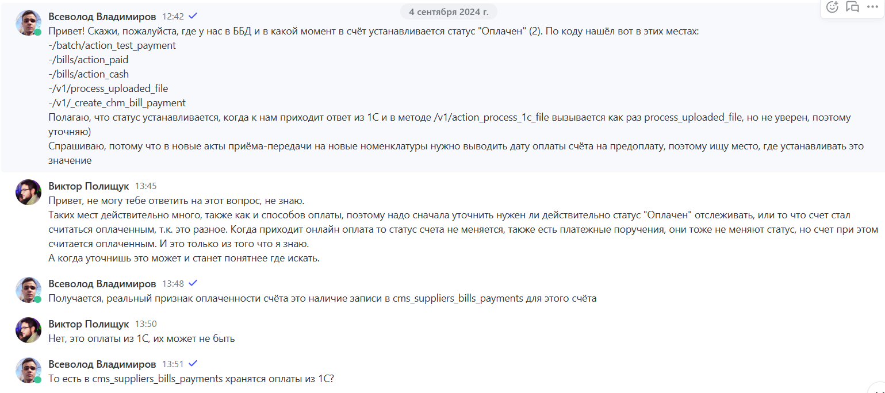
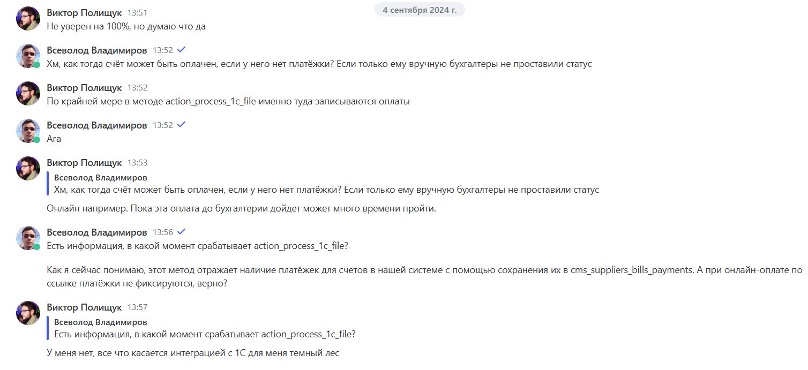
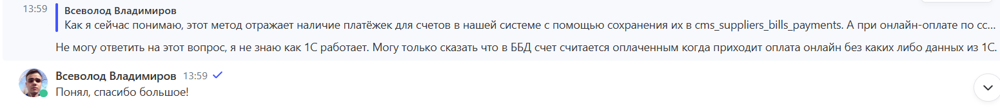

#project #BBD

**Prod link:**
http://bnovo.booking-desk.ru
**GIT link:**
https://git.dev.bnovo.ru/internal/bnovo.booking.desk
**Localhost link:**
http://localhost:10001
http://localhost:8094/
**Stage:**
https://staging.bnovo.booking-desk.ru
**Stage DB:**
http://staging.bnovo.booking-desk.ru:8094/
# Статусы счетов

## Не оплачен (оплачен онлайн)
Определение статусов с припиской **"(оплачен онлайн)"** происходит в методе: `get_status()` (model bill.php) в зависимости от установленного флага [online_received](http://localhost:8094/index.php?route=/sql&pos=0&db=bnovo&table=cms_suppliers_bills) в БД.

В (v1.php) [action_payment()](https://git.dev.bnovo.ru/internal/bnovo.booking.desk/-/blob/master/app/application/classes/controller/api/v1.php?ref_type=heads#L610) есть присвоение флага [online_received](http://localhost:8094/index.php?route=/sql&pos=0&db=bnovo&table=cms_suppliers_bills) = 'Y'
## Оплачен
**Статус устанавливается в следующих местах:**
**v1.php**
[process_uploaded_file()](https://git.dev.bnovo.ru/internal/bnovo.booking.desk/-/blob/master/app/application/classes/controller/api/v1.php#L398), а конкретнее [тут](https://git.dev.bnovo.ru/internal/bnovo.booking.desk/-/blob/master/app/application/classes/controller/api/v1.php#L451)
[create_chm_bill_payment()](https://git.dev.bnovo.ru/internal/bnovo.booking.desk/-/blob/master/app/application/classes/controller/api/v1.php#L1896)

**bills.php**
[action_paid()](https://git.dev.bnovo.ru/internal/bnovo.booking.desk/-/blob/master/app/application/classes/controller/bills.php#L988) 
[action_cash()](https://git.dev.bnovo.ru/internal/bnovo.booking.desk/-/blob/master/app/application/classes/controller/bills.php#L1031)- устаревший метод, никто его не использует. Ранее использовался как оплата наличными.

**batch.php**
[action_test_payment()](https://git.dev.bnovo.ru/internal/bnovo.booking.desk/-/blob/master/app/application/classes/controller/batch.php#L7267) - тестовый платёж, в процессах не используется

### Принцип работы:
Чтобы проставить статус **"Оплачен"**, 1С использует [process_uploaded_file()](https://git.dev.bnovo.ru/internal/bnovo.booking.desk/-/blob/master/app/application/classes/controller/api/v1.php#L398), а бухгалтер использует [action_paid()](https://git.dev.bnovo.ru/internal/bnovo.booking.desk/-/blob/master/app/application/classes/controller/bills.php#L988), если нужно у конкретного счёта установить статус **"Оплачен"**.

Вероятно есть какой-то метод зачета свободных средств на Bnovo Cm ([action_make_reinvest()](https://git.dev.bnovo.ru/internal/bnovo.booking.desk/-/blob/master/app/application/classes/controller/api/v1.php?ref_type=heads#L1773)), в котором вызывается метод, меняющий статус на **"Оплачен"** ([create_chm_bill_payment()](https://git.dev.bnovo.ru/internal/bnovo.booking.desk/-/blob/master/app/application/classes/controller/api/v1.php#L1896))

### Дополнительная информация:
Когда мы выгружаем платежи из 1С происходит проверка на статус **"Оплачен"** и изменение статуса по счёту. 
Альтернатива - это ручное через [action_paid()](https://git.dev.bnovo.ru/internal/bnovo.booking.desk/-/blob/master/app/application/classes/controller/bills.php#L988) и [action_cash()](https://git.dev.bnovo.ru/internal/bnovo.booking.desk/-/blob/master/app/application/classes/controller/bills.php#L1031), там бухгалтер может выставить статус **"Оплачен"** счёту или статус, что он будет оплачен.
### Заметки:
1. Предположительно в [cms_supplier_bills_payments](http://localhost:8094/index.php?route=/sql&pos=0&db=bnovo&table=cms_suppliers_bills_payments) хранятся оплаты из 1С.
2. В методе [action_process_1c_file()](https://git.dev.bnovo.ru/internal/bnovo.booking.desk/-/blob/master/app/application/classes/controller/api/v1.php?ref_type=heads#L386) записываются оплаты.
	1. Когда счёт сформирован, мы делаем **ссылку на оплату** и эта **"ссылка"** - это запись в таблице **transactions** в **платёжном шлюзе**. Затем, когда по этой ссылке происходит оплата, то транзакция помечается как успешная в **платёжном шлюзе**.
	2. Скорее всего дату оплаты мы получаем только когда получили информацию из 1С (сохранили в [cms_supplier_bills_payments](http://localhost:8094/index.php?route=/sql&pos=0&db=bnovo&table=cms_suppliers_bills_payments)).
3. В ББД счёт считается оплаченным, когда приходит оплата без каких-либо данных из 1С.
### Скрины переписок:
**Виктор**



**Борис**


**Катя**


# Платёжное поручение
Платёжное поручение (payments) создаются при: 
**Загрузка из 1С** - бухгалтерия
**Не оплачен (оплачен онлайн)** - В этом случае не создаётся, (Нужно уточнить загружаются ли они из 1С при совершении оплаты и переводе статуса)

Пример платёжного поручения из 1С:

Если платёжное поручение от клиента, то будет индикатор в столбце "Платёжное поручение"

Не оплачен (оплачен онлайн) как статус переходит в "Оплачен онлайн",  если статус не оплачен (оплачен онлайн) и как этот статус переходит в Оплачен (онлайн) - есть ли платёжное поручение


> [!NOTE] Виктория Шарифуллина
> 29 апр, 14:09
> Расписываю кратко текущую логику обработки платежных поручений
> 
> #### Нормальная оплата (сумма платежа соответствует или почти соответствует сумме счета, если счет в евро, допускается погрешность от 0 до 10)
> - Платеж сохраняется в базу
> - Счет получает статус оплачен (status_id = 3)
> - Вызывается изменение баланса на сумму платежа
> #### Частичная оплата (сумма меньше суммы счета)
> - Платеж сохраняется
> - Счет получает статус частично оплачен (status_id = 2)
> - Вызывается изменение баланса на сумму платежа
> #### Переплата (сумма платежа больше суммы счета)
> - Отправляется **письмо об ошибке** в финансовый отдел
> - **Новый платеж НЕ сохраняется** в базу данных
> - Статус счета **НЕ меняется** (status_id остается прежним)
> - Но баланс увеличивается на сумму не подтвержденного платежа (то есть присутствует предполагаемый рассинхрон между фактическими платежами и балансом)
> 
> Но есть важное уточнение, что это зависит от текущего статуса счета. Сейчас метод изменения баланса вызывается по условию, что у счета статус "Оплачен" или "Частично оплачен", больше никаких условий нет. То есть в данной логике никак не учитывается, сохранился ли платеж на предыдущих шагах или нет. Мы лишь в конце проверяем статус и применяем изменения для баланса.
> 
> То есть условно может быть такая ситуация, что выставляются платежные поручения на счет, у которого уже есть статус "Частично оплачен". По текущим условиям платеж мы не сохраняем, статус счета без изменений. В конце по нашим условиям(статус "Оплачен" или "Частично оплачен") мы меняем баланс у договора.
# Шлюз оплат (10, 48)
При подключённом шлюзе в PMS и наличии договора BBD на шлюз оплат (10) или шлюз оплат 0,5 (48) у клиентов появляется возможность выставления гостям ссылок на онлайн-оплату (то есть гость забронировал отель и может внести предоплату или полностью оплатить свое проживание).

> [!NOTE] Катя Гавриленко
> Шлюз оплат - это как доп функционал в PMS.

## Выставление счетов:
На "Шлюз оплат 0.5" (48) счёт выставляется путём загрузки файла в разделе "Комиссия" -> "Выставление счетов за Шлюз оплат 0,5"

На "Шлюз оплат" (10) выставление счетов происходит в методе `action_generate_bills()` в классе batch
## Принцип работы:
В случае 10 и 48 шлюзов в BBD создаётся договор. 

> [!NOTE] Катя Гавриленко
> Как это обеспечивается? и в случае 10, и в случае 48 в BBD создается договор (скриншот 1) Добавляется информация о том, через какую платежную систему будут проходить платежи (скриншот 2) 
> И заполняется информация, которая требуется для технического подключения (скриншот 3)
> То есть без скриншота 2 и 3 шлюз работать не будет


# Транзакции
Определение количества остаточных транзакций у клиента происходит в [Model_Supplierdoc](https://git.dev.bnovo.ru/internal/bnovo.booking.desk/-/blob/master/app/application/classes/model/supplierdoc.php) в методе `need_bill()` происходит запрос к счетам и `onlinepaymentv2transaction` на основании запросов получаем следующие переменные:

`$transactions_billed` - находим количество не архивных счетов у клиента и умножаем это на 80 транзакций, таким образом получаем общее количество транзакций у клиента по счетам. 
*(Ранее была оплата по каждой транзакции, но потом было решено взять усреднённое значение в 80 транзакций за счёт с платой в 1600р, считается, что так для клиентов было удобнее, чем платить за каждую транзакцию отдельно)*

`$transactions_maid_chargable` - количество занятых транзакций (уже использованных) 

`$transactions_maid_not_chargable` - количество не занятых транзакций. В запрос передаётся дата, которая высчитывается по правилу был ли найден договор с датой старше `2023-02-01`. Используется для старых тарифов, когда транзакции ещё были бесплатными.

`$archived_plan_paygate_doc` - делаем запрос к `supplierdoc` где `start_date` < `2023-02-01` и выставляем дату транзакции в `$transactions_date` следующим образом:
- Если находим договоры, то `'2023-06-01 00:00:01'` 
*// Если партнер работает по архивным условиям оплаты за шлюз оплат (начал работать до 1 февраля 2023),*
*// то для него транзакции по бесплатным шлюзам считаются только с 1 июня 2023*
- Если не находим, то `2023-02-01 00:00:01`
*// Если партнер работает по текущим условиям, то для него транзакции по бесплатным шлюзам*
*// считаются с 1 февраля 2023 (с даты изменения условий)*

Далее складываются транзакции:

```php
$transactions_maid = $transactions_maid_chargable + $transactions_maid_not_chargable;
```

После срабатывает условие по определению о необходимости выставления нового счёта для транзакций, если они были исчерпаны:

```php
if ($transactions_maid && ($transactions_maid >= $transactions_billed)
```

## Дополнительно
Переписка с архитектором:
> [!NOTE] Кирилл Белов
> У нас начали выставляться счета каждый день на тип Шлюз оплат для одного и того же договора. Поговорил с Катей, чтобы понять, в чем вообще проблема: Она сказала, что счет должен выставляться только тогда, когда 80 транзакций израсходованы, но сейчас - эти транзакции не успевают израсходоваться и создается новый счет. Как я понял, создается счет на 80 транзакций и где-то в сервисе payment они хранятся и каждый раз при оплате - списывается одна транзакции в сервисе payment и каждый вечер ~ в 18:10 запускается джоба, которая проверяет количество оставшихся транзакций и создает новый счет, если количество транзакций кончилось. Как я понял - проверка на то, нужен ли счет происходит в Supplierdoc::need_bill, но я не понимаю, что за переменные: 1. transactions_billed - количество уже прошедших транзакций? 2. transactions_maid_chargable - количество транзакций, уже занятых? 3. transactions_maid_not_chargable - количество транзакций не занятых? И потом получается проверяется, если количество занятых и не занятых транзакций >= транзакций уже прошедших, то нужно создавать счет новый?

> [!NOTE] Виктор Полищук
> Да, суть примерно такая. Количество транзакции мы нигде не храним, каждый раз делаем запрос в БД шлюза и считаем их. Такое уже случалось, но я не помню причину. Возможно из-за того что что-то произошло со старыми счетами и все прошлые транзакции перестали быть засчитанными. $transactions_billed - это количество оплаченных транзакций. Мы ищем все старые не заархивированные счета и умножаем их на количество транзакций в одном счете. Т.е. каждый активный старый счет - это 80 оплаченных транзакций. $transactions_maid_chargable - проведенные транзакции, которые нужно оплатить (is_chargable - флаг того что шлюз платный, раньше у нас некоторые шлюзы были бесплатными и их не надо было учитывать тут) $transactions_maid_not_chargable - проведенные транзакции, которые раньше не нужно было оплачивать (по бесплатным шлюзам) Поскольку нужно учитывать что раньше некоторые шлюзы были бесплатными отдельно запрашиваются $transactions_maid_not_chargable, которые были сделаны с определенной даты - только за них нужно платить.
# УПД (Универсальный передаточный документ)
1. **Счета на старые номенклатуры** - УПД формируются по факту окончания месяца в счете/периода счета. 
   Например, счет на 43 номенклатуру с 15.05 по 15.08 на сумму 3000 руб - УПД будут формироваться таким образом: 
   - УПД от 31.05 на сумму 500 руб
   - УПД от 30.06 на сумму 1000 руб
   - УПД от 31.07 на сумму 1000 руб
   - УПД от 15.08 на сумму 500 руб
   (46,47,48)
2. **Счета на постоплатные номенклатуры** - УПД формируются по факту выставления. 
   Например, постоплатный счет на 46 номенклатуру с 1.03 по 31.03 на сумму 1900 руб, дата выставления счета 3.04 - УПД формируется таким образом: 
   УПД от 3.04 на сумму 1900

Для предоплатных счетов формируются на странице /commission/ при загрузке файла в **Загрузка данных о размерах вознаграждения**:


УПД имеют следующий адрес /public/upload/acts/[номер счёта]-[номер УПД по счёту]pdf.


> [!Всеволод Владимиров]
> В общем, у счетов в большинстве случаев есть УПД (универсальный передаточный документ). В зависимости от периода счёт делится на части, и по каждой части формируется УПД с частью общей суммы. Это делается потому что юридически нельзя сразу заплатить за услугу или чёт такое
> 
> УПД нигде не хранятся, они формируются в этом методе get_upd_docs_list в рантайме, в зависимости от периода, номенклатуры и других параметров


# Письма
## Письма в рамках [DEV-2211](https://tracker.yandex.ru/DEV-2211)
У нас есть 2 места, где запускается отправка сообщения
1. В [action_schedule()](https://git.dev.bnovo.ru/internal/bnovo.booking.desk/-/blob/master/app/application/classes/controller/batch.php#L32) происходит запуск [action_send_new_tariffs_expired_mail()](https://git.dev.bnovo.ru/internal/bnovo.booking.desk/-/blob/master/app/application/classes/controller/batch.php#L268) 
Тут отправляются письма только при блокировке продукта, если они были не оплачены более 14 дней.
2. В [processReportDataFile()](https://git.dev.bnovo.ru/internal/bnovo.booking.desk/-/blob/master/app/application/classes/services/commissionlicensorreportservice.php#L5) происходит вызов сервиса вот [тут](https://git.dev.bnovo.ru/internal/bnovo.booking.desk/-/blob/master/app/application/classes/services/commissionlicensorreportservice.php#L54) 
Тут письма отправляются только после формирования отчёта лицензиара. Передаются последние актуальные счета и они прогоняются по условиям и уже на основании условий определяется тип письма:
	*Есть задолженность по счету*
	*Ваш счет оплачен*
Второй пункт обоснован тем, что мы не можем отправлять письмо ещё до того, как сформированы все файлы. по этому и было решено поступить таким образом.

# Выставление счетов
## Отчёт лицензиара
Сам по себе отчёт лицензиара представляет собой перечень начислений за каждого, кто поселился за период в конкретном отеле с кем есть договор.

> [!NOTE] Всеволод Владимиров
> Отчёт лицензиара отображает, сколько бронирований за какие деньги было у отеля за период


# Проблемы

Не работает локально метод POST между PMS и BBD по какой-то причине, только GET
Дополнение по POST:
https://app.pachca.com/chats?thread_message_id=518131259


Может не записывать в логи из-за прав в папке **app/application/logs**.
Проверить создание файла и папки можно через:
```php
Kohana::$log->write()
```
